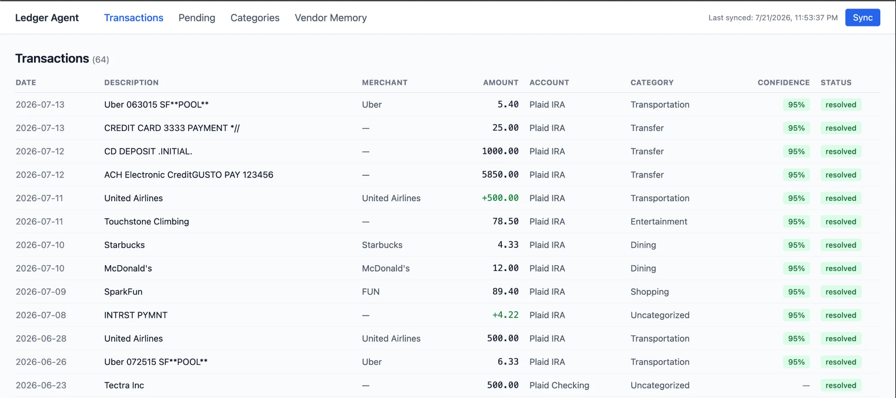
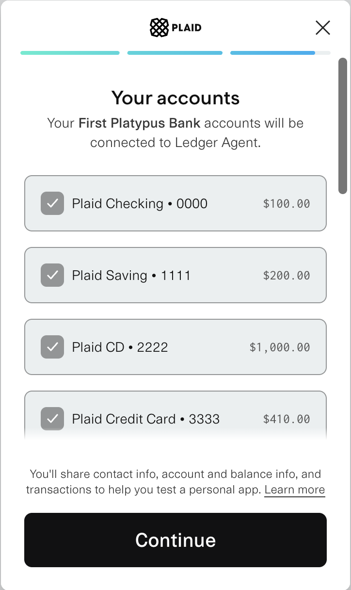
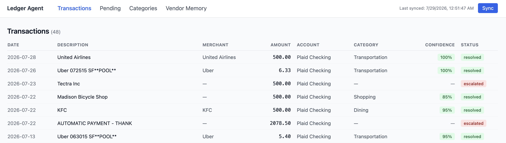
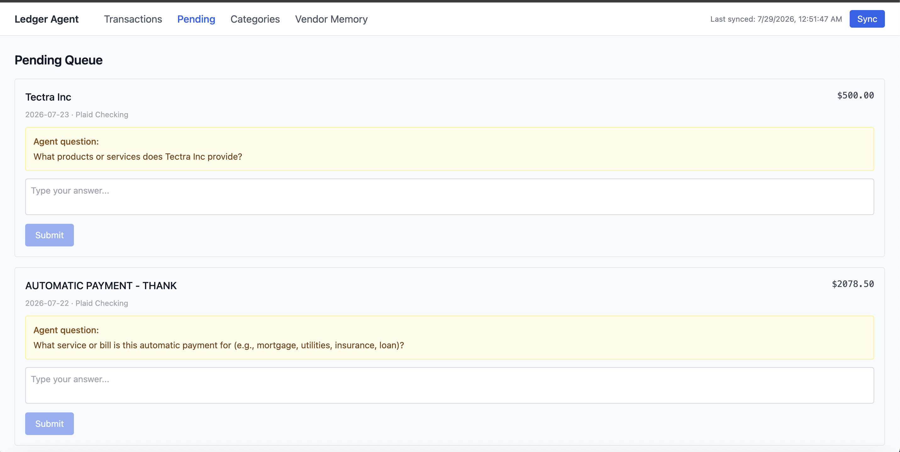
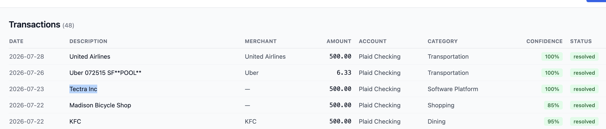

# Ledger Agent

A local-first personal finance tool that pulls transactions from every linked bank account via Plaid, auto-categorizes them with an LLM-based agent, and escalates anything it isn't confident about to a human — instead of paying for Rocket Money, Monarch, or Copilot to do it in a black box.

Built as a project to go deep on two things: **agentic workflow design** (LangGraph, human-in-the-loop interrupts, persistent memory) and **evaluating LLM systems properly** (a static labeled benchmark, isolated eval schema, precision/recall on escalation — not just vibes).

> **Status:** personal project / working prototype, not a production financial product. It runs entirely on my own machine against my own accounts. See [Known Limitations](#known-limitations--what-id-fix-next) — I'm listing them on purpose.

## Table of Contents

- [What it does](#what-it-does)
- [How it works](#how-it-works)
- [Why LangGraph, not just a REST call to an LLM](#why-langgraph-not-just-a-rest-call-to-an-llm)
- [Evaluation](#evaluation)
- [Architecture](#architecture)
- [Quick Start](#quick-start)
- [Known Limitations & what I'd fix next](#known-limitations--what-id-fix-next)
- [Roadmap](#roadmap)
- [Tech Stack](#tech-stack)

## What it does



1. Link one or more bank accounts through Plaid.

   

2. Transactions sync in and pass through a classification agent that assigns a category and a confidence score.

   

3. High-confidence classifications resolve automatically. Everything else lands in a **pending queue** with the agent's specific question ("Was this Amazon purchase groceries or a subscription?") instead of a generic "please categorize."

   

4. Answering a pending item **resumes the same agent run** — it doesn't restart from scratch — and the resolution gets remembered so the same vendor doesn't need to be asked twice. Categories aren't fixed either — answering "Software Platform" for a vendor Claude didn't recognize (`Tectra Inc`) first meant adding it as a custom category, then the escalation resolved straight into it:

   

5. Every transaction keeps a reasoning trace: which category was picked, the confidence score, and why (vendor memory hit vs. fresh LLM call).

## How it works

```
Plaid sync → Transaction created
                  │
                  ▼
            ┌─────────────┐
            │   lookup    │  seen this vendor before?
            └──────┬──────┘
             yes ───┼─── no
                  ▼         ▼
          ┌──────────┐  ┌───────────┐
          │auto_resolve│  │ classify  │  Claude call → category + confidence + reasoning
          └──────────┘  └─────┬─────┘
                               │
                    confidence ≥ 0.80 ──── < 0.80
                               │                │
                               ▼                ▼
                       ┌──────────────┐  ┌───────────┐
                       │ auto_resolve │  │ escalate  │  interrupt() — graph pauses,
                       └──────────────┘  └─────┬─────┘  txn shows up in pending queue
                                                │
                                     human answers in the UI
                                                │
                                                ▼
                                  graph resumes at the same node,
                                  writes resolution + vendor memory
```

This is a [LangGraph](https://github.com/langchain-ai/langgraph) `StateGraph` ([`agent/graph.py`](backend/src/ledger_agent/agent/graph.py)) with four nodes ([`agent/nodes.py`](backend/src/ledger_agent/agent/nodes.py)) and Postgres checkpointing, so an in-flight run survives an API restart — if the backend crashes mid-escalation, the transaction is still sitting in `escalated` state and resuming it replays from the checkpoint rather than losing the run.

## Why LangGraph, not just a REST call to an LLM

The part that doesn't fit in a single request/response cycle is the **escalation → human answer → resume** loop. A transaction can sit in "needs review" for hours or days before someone answers it, and when they do, the agent needs to pick up exactly where it left off — not re-run the classification, not lose the original transaction context.

LangGraph's `interrupt()` primitive does this natively: the `escalate` node calls `interrupt(question)`, the graph process returns immediately, and the run is durably checkpointed. Answering the question later calls `graph.invoke(Command(resume=answer), config=thread_config)`, and execution continues inside the *same* node with the *same* state — no re-classification, no re-fetching the transaction, no separate "resolution" system bolted on the side.

I'd call this a **constrained human-in-the-loop classification workflow**, not an open-ended autonomous agent — it doesn't pick tools or plan dynamically, and that's deliberate. Financial categorization needs predictable, auditable decisions and an explicit escalation path, not free-ranging autonomy.

## Evaluation

Most "I built an AI agent" projects stop at a demo. This one has a real harness for the eval a Ramp-style Applied AI role actually cares about, in [`eval/runner.py`](backend/src/ledger_agent/eval/runner.py):

- **Static, hand-labeled benchmark** — [`eval_dataset.csv`](eval_dataset.csv), 120 rows across the 10 default categories, each labeled `is_genuinely_ambiguous` by hand ([labeling guide](eval_dataset_README.md)). Ambiguous means "two reasonable people would disagree given only this description and amount" — e.g. a `Costco` charge could be Groceries or Shopping, but `Netflix` is unambiguously Entertainment.
- **Isolated `eval` Postgres schema**, wiped and reseeded before every run, so eval traffic never touches real transaction data and every run starts from the same clean state.
- **Metrics that separate "confident and right" from "confident and wrong"** ([`eval/metrics.py`](backend/src/ledger_agent/eval/metrics.py)):
  - *Accuracy* — of the transactions the agent auto-resolved (didn't escalate), what fraction got the right category?
  - *Escalation precision* — of the transactions it escalated, what fraction were actually ambiguous (vs. escalating things a human would find obvious)?
  - *Escalation recall* — of the genuinely ambiguous transactions, what fraction did it correctly flag instead of confidently guessing?
- **Prompt + model versioning** — every run hashes the classification prompt and records the model version alongside the metrics, so a regression can be traced to "the prompt changed" vs. "the model changed."
- **Run history** — results are persisted to an `eval_runs` table, and each run prints a diff against the previous one (`Accuracy: 91.7% (previous: 88.3%, +3.4)`), so prompt/model changes show up as a visible before/after instead of a one-off number.

Run it yourself:

```bash
cd backend
python -m ledger_agent.eval.runner
```

I'm intentionally not printing a results table with made-up numbers here — run the command above against your own `ANTHROPIC_API_KEY` and you'll get real, current numbers instead of a screenshot that goes stale the next time the prompt changes.

## Architecture

- **Backend:** FastAPI + SQLAlchemy 2.x (async) + Alembic + LangGraph, Python managed with `uv`
- **Frontend:** React 19 + Vite + TanStack Query + React Router + Tailwind CSS
- **Database:** PostgreSQL — `public` schema for live data, a fully isolated `eval` schema for benchmark runs
- **Agent runtime:** LangGraph graph compiled with a Postgres checkpointer, so classification/escalation state survives process restarts
- **Ingestion:** Plaid `/transactions/sync` via a background thread per sync job, with transfer-pair detection so an internal transfer between two of your own linked accounts doesn't get double-counted as spend
- **Testing:** 133 tests across agent nodes (confidence boundaries, JSON parsing, vendor memory, escalation/resume, fallback categories), graph execution, all API routes, Plaid sync, and the eval harness itself

Full design decisions and trade-offs: [`_bmad-output/planning-artifacts/architecture.md`](../_bmad-output/planning-artifacts/architecture.md)

## Quick Start

**Prerequisites:** Docker & Docker Compose, a [Plaid developer account](https://plaid.com/docs/quickstart/) (sandbox is free), an [Anthropic API key](https://console.anthropic.com/).

```bash
cp .env.example .env
# fill in PLAID_CLIENT_ID, PLAID_SECRET, and ANTHROPIC_API_KEY
docker compose up
```

| Service | URL |
|---|---|
| Frontend | http://localhost:5173 |
| Backend API | http://localhost:8000 |
| API docs (Swagger) | http://localhost:8000/docs |

**Local development without Docker:**

```bash
# backend
cd backend
uv sync
alembic upgrade head
uvicorn ledger_agent.main:app --reload

# frontend
cd frontend
npm install
npm run dev
```

## Known Limitations & what I'd fix next

Listing these on purpose — knowing exactly where a system's sharp edges are is the point of building it.

- **Vendor-memory feedback loop.** `auto_resolve_node` writes to vendor memory after *any* auto-resolved classification, including ones the LLM decided on itself — not only human-confirmed ones. A confidently wrong classification can become a permanent fast-path for that vendor. Fix: only promote a vendor to the memory fast-path after a human-confirmed resolution, or after N consistent classifications, and track provenance (`model_inferred` vs. `user_confirmed`) instead of collapsing both into one `hit_count`. See [`agent/nodes.py`](backend/src/ledger_agent/agent/nodes.py).
- **Confidence is self-reported by the model**, and 0.80 is a fixed threshold with no calibration check against actual correctness. The eval harness already has everything needed to fix this (accuracy-by-confidence-bucket, selective accuracy on auto-resolved cases only) — it just isn't broken out that way yet.
- **No cold-start vs. memory-assisted eval split.** The benchmark resets the schema before running, but vendor memory can still be written *during* a run if the same normalized vendor string repeats across rows, so later rows aren't guaranteed independent of earlier ones in that run.
- **Background jobs are daemon threads inside the FastAPI process** (Plaid sync, classification), not a durable job queue. Fine for a single-user local app; a process restart mid-sync loses that job, and per-transaction failures are logged and skipped without flipping the overall sync to a `complete_with_errors` state.
- **No auth, and Plaid access tokens are stored in plaintext** in the `accounts` table. This is a single-user local-first tool by design and is not meant to be exposed on a network — if you run it, keep it on `localhost` only.
- **What Anthropic sees:** each classification call sends the transaction description, merchant name, amount, and date to the Anthropic API. No account numbers or Plaid access tokens are ever included in the prompt.

## Roadmap

Rough priority order, not commitments. Some of these fix the limitations above; some are new capability.

**UI overhaul**
- [ ] Replace the current bare Tailwind tables with an actual dashboard: balance summary across accounts, spend-by-category breakdown, month-over-month trend.
- [ ] Add a charting library (nothing wired in yet — likely [Recharts](https://recharts.org/)) for a spend-by-category pie/donut chart and a spend-over-time line chart.
- [ ] Group the Transactions table by account/institution instead of one flat list, once multi-bank grouping exists (below).
- [ ] Give the reasoning trace and confidence score better visual treatment than a plain badge — right now [`ReasoningTrace.tsx`](frontend/src/components/ReasoningTrace.tsx) is only surfaced on the detail page.

**Multi-bank support**
- [ ] This is half-built already: `POST /plaid/exchange-token` appends new accounts under a new `item_id`/`access_token` without touching existing ones ([`api/accounts.py`](backend/src/ledger_agent/api/accounts.py):28), so the backend has no problem holding accounts from several banks at once. But the frontend only ever renders the Plaid Link button on the zero-accounts welcome screen ([`App.tsx`](frontend/src/App.tsx):32-41) — there's no "connect another bank" entry point once you have one. That's the actual gap, and it's a small one.
- [ ] Add a `PlaidItem` model (one row per linked institution — `item_id`, `access_token`, institution name) instead of repeating the same access token on every `Account` row under that item.
- [ ] Institution-level grouping in the UI so it's clear which accounts came from which bank.

**Sync logic rework**
- [ ] Migrate off the legacy `/transactions/get` date-window polling ([`plaid_client.py`](backend/src/ledger_agent/ingestion/plaid_client.py):52) to Plaid's cursor-based `/transactions/sync` endpoint. It's the currently-recommended API, and unlike the current implementation it natively reports modified and removed transactions — right now, if Plaid later corrects or removes a transaction, this app never finds out; ingestion only ever inserts.
- [ ] Replace the daemon-thread-in-the-FastAPI-process model with a real job queue (Celery/Dramatiq/Arq/a Postgres job table). We hit exactly why this matters this week: the classification thread deadlocked against Postgres's own `CREATE INDEX CONCURRENTLY` the first time it ran against a fresh database (`checkpointer.setup()` in [`agent/runner.py`](backend/src/ledger_agent/agent/runner.py) held a read transaction open that blocked the index build it was itself waiting on) — a single in-process thread with no timeout just hung forever with no way for anything to notice.
- [ ] Fix the orphaned-`sync_run` gap that deadlock exposed: the startup-recovery path that resumes pending classifications after a restart doesn't know which `sync_run` requested that work, so it never marks it complete. The UI can be stuck showing "Syncing…" indefinitely even after the work has actually finished — had to close that row out by hand.
- [ ] A `complete_with_errors` status plus persisted per-transaction failure counts, instead of silently skipping failed rows within a sync that still reports "complete."
- [ ] Add `logging.basicConfig()` somewhere — there is currently no logging configuration in the app at all, so every `logger.info`/`logger.exception` call in the sync and agent modules is silently swallowed. Diagnosing the deadlock above required querying Postgres's `pg_stat_activity` directly, because `docker compose logs` showed nothing.

**Also worth doing**
- [ ] Vendor-memory provenance — distinguish `model_inferred` from `user_confirmed` so an unverified LLM classification can't silently become a permanent fast path (see [Known Limitations](#known-limitations--what-id-fix-next)).
- [ ] Confidence calibration — break the eval harness down by confidence bucket, selective accuracy on auto-resolved cases, and a per-category confusion matrix instead of one accuracy number.
- [ ] Cold-start vs. memory-assisted eval split, so benchmark results aren't order-dependent on which rows ran first.
- [ ] Encrypted Plaid access tokens and a real single-user auth boundary before this is anything other than local-only.
- [ ] CI — run tests, lint, and type-check on every push.

## Tech Stack

Python · FastAPI · SQLAlchemy 2.x · Alembic · LangGraph · PostgreSQL · Anthropic API (Claude) · Plaid API · React 19 · TypeScript · Vite · TanStack Query · Tailwind CSS · Docker Compose · pytest
